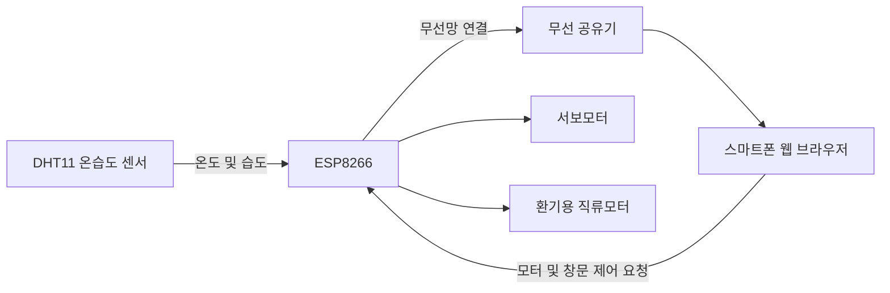
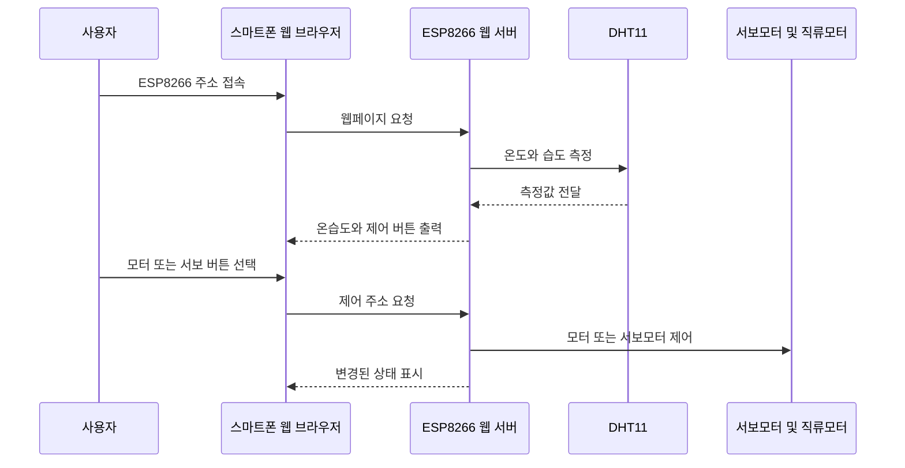
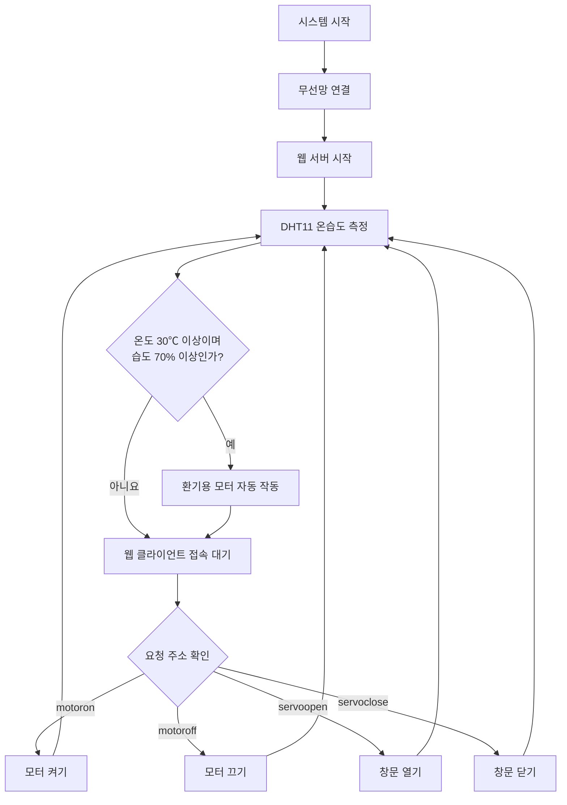

# 피지컬컴퓨팅 - ESP8266을 이용한 여름철 온습도 관리 시스템

> ESP8266과 DHT11 온습도 센서를 이용하여 실내 환경을 확인하고, 웹페이지에서 환기용 모터와 창문 모형을 제어하는 피지컬컴퓨팅 프로젝트입니다.

<p align="center">
  
</p>

---

## 프로젝트 개요

| 구분 | 내용 |
|---|---|
| 프로젝트명 | 피지컬컴퓨팅 - ESP8266을 이용한 여름철 온습도 관리 시스템 |
| 프로젝트 주제 | 스마트홈 원격 환기 시스템 |
| 개발 형태 | 2인 팀 프로젝트 |
| 개발 기간 | 2023년 |
| 주요 장치 | ESP8266, DHT11, 서보모터, 직류모터 |
| 개발 분야 | 피지컬컴퓨팅, 사물인터넷, 임베디드 웹 서버 |
| 담당자 | 백주원, 이도윤 |
| 개발 결과 | 자동 및 수동 환기 기능 구현 |

---

## 프로젝트 소개

여름철 장기간 집을 비울 경우 실내 온도와 습도가 높아지면서 곰팡이가 발생하거나 실내 환경이 악화될 수 있습니다.

본 프로젝트는 ESP8266과 온습도 센서를 이용하여 실내 환경을 확인하고, 웹페이지에서 창문 모형과 환기용 모터를 제어할 수 있도록 제작한 스마트 환기 시스템입니다.

발표자료에서는 여름철 장기간 자리를 비워도 실내의 곰팡이 발생을 방지하고 깨끗한 실내 환경을 유지하는 것을 프로젝트의 목적으로 설정했습니다.

---

## 주요 기능

### 실시간 온습도 확인

DHT11 센서를 이용하여 실내 온도와 습도를 측정합니다.

측정된 값은 ESP8266이 제공하는 웹페이지에 표시됩니다.

```text
Temperature: 현재 온도
Humidity: 현재 습도
```

---

### 환기용 모터 제어

직류모터와 프로펠러를 이용하여 환기용 선풍기를 구현했습니다.

웹페이지에서 다음 기능을 사용할 수 있습니다.

- 모터 켜기
- 모터 끄기
- 현재 모터 상태 확인

---

### 창문 모형 제어

서보모터를 이용하여 창문 모형을 열고 닫습니다.

웹페이지에서 다음 기능을 사용할 수 있습니다.

- 창문 열기
- 창문 닫기

---

### 온습도 기반 자동 환기

측정된 온도와 습도가 설정된 기준 이상일 경우 창문을 닫고 환기용 모터를 작동하도록 구현했습니다.

```text
온도 30℃ 이상
그리고
습도 70% 이상

→ 서보모터 동작
→ 환기용 모터 작동
```

현재 소스 코드에서는 다음 조건을 사용합니다.

```cpp
if (temp >= 30 && humi >= 70)
{
    servo.write(0);

    digitalWrite(INAPIN, HIGH);
    digitalWrite(INBPIN, LOW);

    motorState = true;
}
```

---

## 시제품 구성

<p align="center">
  
</p>

시제품은 다음 요소로 구성됩니다.

- ESP8266 개발 보드
- DHT11 온습도 센서
- 서보모터
- 직류모터와 프로펠러
- 모터 드라이버
- 브레드보드
- 창문 모형
- 스마트폰 웹 브라우저

발표자료의 시연 사진에서는 스마트폰 웹페이지에서 온도, 습도, 모터 상태를 확인하고 서보모터와 모터를 제어하는 모습을 확인할 수 있습니다. :contentReference[oaicite:3]{index=3}

---

## 시스템 구조



---

## 웹페이지 요청과 장치 제어 과정



---

## 웹페이지 기능

| 기능 | 요청 주소 | 동작 |
|---|---|---|
| 메인 페이지 | `/` | 온도, 습도, 모터 상태 표시 |
| 모터 켜기 | `/motoron` | 직류모터 정방향 회전 |
| 모터 끄기 | `/motoroff` | 직류모터 정지 |
| 창문 열기 | `/servoopen` | 서보모터를 140도로 이동 |
| 창문 닫기 | `/servoclose` | 서보모터를 0도로 이동 |

---

## 동작 흐름



---

## 사용 기술

### 하드웨어

| 부품 | 역할 |
|---|---|
| ESP8266 | 무선망 연결 및 웹 서버 운영 |
| DHT11 | 실내 온도와 습도 측정 |
| 서보모터 | 창문 모형 개폐 |
| 직류모터 | 환기용 선풍기 구동 |
| 모터 드라이버 | 직류모터 제어 |
| 브레드보드 | 회로 구성 |
| 창문 모형 | 환기 시스템 시연 |

발표자료에서도 온습도 센서, 서보모터, 직류모터, ESP8266을 주요 부품으로 제시하고 있습니다. 

### 소프트웨어

- 아두이노 통합 개발 환경
- 아두이노 기반 C/C++
- ESP8266 무선 통신
- ESP8266 웹 서버
- HTML
- CSS
- HTTP 요청 처리

### 사용 라이브러리

```cpp
#include <ESP8266WiFi.h>
#include <DHT11.h>
#include <Servo.h>
#include <Adafruit_Sensor.h>
```

---

## 핀 구성

| 부품 | ESP8266 핀 |
|---|---:|
| DHT11 온습도 센서 | GPIO2 |
| 모터 드라이버 INA | GPIO0 |
| 모터 드라이버 INB | GPIO4 |
| 서보모터 | D1, GPIO5 |

---

## 핵심 구현

### 무선망 연결

ESP8266을 기존 무선 공유기에 연결합니다.

연결이 완료되면 직렬 모니터에 할당된 인터넷 주소가 표시됩니다.

```text
Connecting to ...
WiFi connected
IP address:
192.168.x.x
```

---

### 웹 서버 구현

ESP8266의 80번 포트에서 웹 서버를 실행합니다.

```cpp
WiFiServer server(80);
```

클라이언트가 접속하면 온도, 습도, 모터 상태와 장치 제어 버튼이 포함된 HTML 문서를 전달합니다.

---

### 온습도 출력

DHT11에서 온도와 습도를 읽어 문자열로 변환한 뒤 웹페이지에 출력합니다.

```cpp
dht11.read(humi, temp);

h = String(humi);
t = String(temp);
```

---

### 모터 제어

모터 드라이버의 두 입력 핀을 제어하여 직류모터를 작동하거나 정지합니다.

```text
INA 높음, INB 낮음
→ 모터 작동

INA 낮음, INB 낮음
→ 모터 정지
```

---

### 서보모터 제어

서보모터 각도를 변경하여 창문 모형을 열고 닫습니다.

```text
140도
→ 창문 열기

0도
→ 창문 닫기
```

---

## 실험 및 개발 과정

| 날짜 | 진행 내용 |
|---|---|
| 5월 27일 | 온습도 센서 활용 방안 및 프로젝트 과정 설계 |
| 5월 27일 | 무선망 연결 코딩 및 웹 서버 구축 |
| 6월 5일 | 테스트 시간대 설계 및 온도 테스트 |
| 6월 5일 | 웹 서버 제어 버튼, 서보모터, 환기용 팬 구현 |
| 6월 9일 | 온도 조건 기반 자동 작동 코드 설계 |
| 6월 10일 | 습도 센서 구현 완료 및 프로그램 동작 점검 |

발표자료에서는 약 1주간 자료를 수집하고, 온습도 센서와 웹 서버, 서보모터 및 환기용 팬 기능을 순차적으로 구현한 것으로 정리되어 있습니다.

---

## 실험 데이터

| 날짜 | 시간 | 온도 | 습도 | 환기 가능 여부 |
|---|---|---:|---:|---|
| 6월 11일 | 오전 9시 | 27℃ | 53.6% | 가능 |
| 6월 11일 | 오후 9시 | 22℃ | 55.8% | 가능 |
| 6월 13일 | 오전 9시 | 26℃ | 54.7% | 가능 |
| 6월 13일 | 오후 9시 | 21℃ | 64.4% | 가능 |
| 6월 15일 | 오전 9시 | 28℃ | 70.2% | 불가능 |
| 6월 15일 | 오후 9시 | 19℃ | 85.5% | 불가능 |
| 6월 17일 | 오전 9시 | 25℃ | 68.1% | 불가능 |
| 6월 17일 | 오후 9시 | 20℃ | 62.7% | 가능 |
| 6월 19일 | 오전 9시 | 28℃ | 52.6% | 가능 |
| 6월 19일 | 오후 9시 | 21℃ | 53.8% | 가능 |

---

## 기대 효과

- 장기간 자리를 비운 상황에서도 실내 온도와 습도 확인
- 웹페이지를 이용한 환기용 모터 원격 제어
- 창문 모형의 원격 개폐
- 고온다습한 환경에서 자동 환기
- 실내 곰팡이 발생 가능성 감소
- 주거 공간뿐만 아니라 창고와 저장시설에 활용 가능

발표자료에서는 주거 공간뿐만 아니라 상업시설, 창고 및 저장시설에도 시스템을 활용할 수 있다고 제안했습니다.

---

## 개발 결과

- ESP8266 무선망 연결 성공
- ESP8266 웹 서버 구현
- DHT11 온도 및 습도 측정
- 웹페이지 온습도 출력
- 직류모터 원격 제어
- 서보모터 원격 제어
- 온습도 조건 기반 자동 환기
- 실제 작동 가능한 환기 시스템 시제품 제작

프로젝트 수행 결과에서는 스마트홈 원격 환기 시스템의 실현 가능성을 확인하고, 여름철 실내 관리 문제를 해결할 수 있는 방법을 제시했다고 평가했습니다. 

---

## 기술적 회고

### 잘된 점

- ESP8266 하나로 무선망 연결과 웹 서버를 구현했습니다.
- 별도의 응용프로그램 없이 웹 브라우저에서 장치를 제어했습니다.
- 온습도 센서, 직류모터, 서보모터를 하나의 시스템으로 통합했습니다.
- 수동 제어와 센서 조건 기반 자동 제어를 함께 구현했습니다.
- 실제 창문과 환기 장치를 모형으로 제작하여 동작을 확인했습니다.

### 개선할 점

- 무선망 이름과 비밀번호를 소스 코드에서 분리
- 공개 저장소에 실제 무선망 비밀번호를 업로드하지 않도록 수정
- 센서 측정 실패에 대한 예외 처리 추가
- 자동 모드와 수동 모드의 우선순위 분리
- 환기 시작 조건과 종료 조건을 다르게 설정하여 반복 작동 방지
- `delay()` 기반 처리를 비차단 방식으로 개선
- HTML과 장치 제어 코드를 별도 파일과 함수로 분리
- 웹페이지 디자인 개선
- 온습도 기록 저장 및 그래프 시각화
- 모터 작동 시간 제한과 안전장치 추가


## 저장소 구조

```text
.
├── README.md
├── src
│   └── summer_environment_system.ino
└── docs
    ├── 발표자료.pdf
    └── images
        ├── project-result.jpg
        ├── web-interface.png
        ├── circuit.png
        └── system-flow.png
```

---

## 프로젝트를 통해 얻은 경험

- ESP8266 기반 무선 통신 구현
- 마이크로컨트롤러 웹 서버 구축
- DHT11 온습도 센서 활용
- 직류모터와 모터 드라이버 제어
- 서보모터를 이용한 창문 모형 제어
- HTML 기반 장치 제어 화면 구현
- 센서 입력과 구동부 출력의 연계
- 피지컬컴퓨팅 프로젝트 설계 및 구현
- 팀 프로젝트 일정 관리와 기능 분담

---

## 관련 자료

- [프로젝트 소스 코드](src/summer_environment_system.ino)
- [프로젝트 발표자료](docs/발표자료.pdf)
